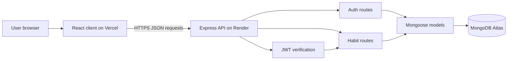
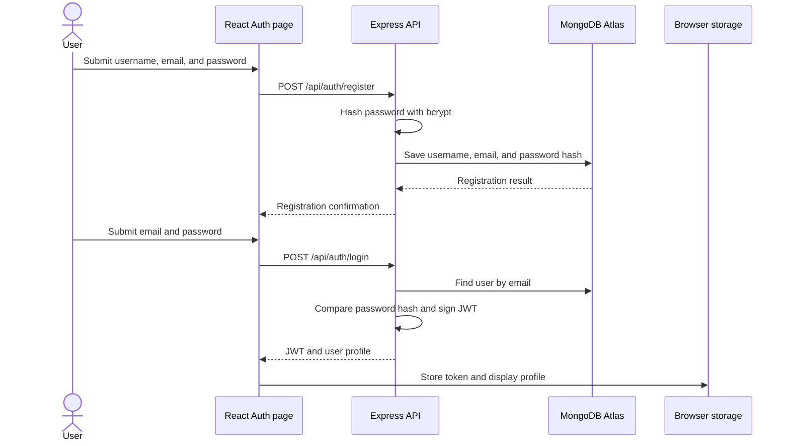
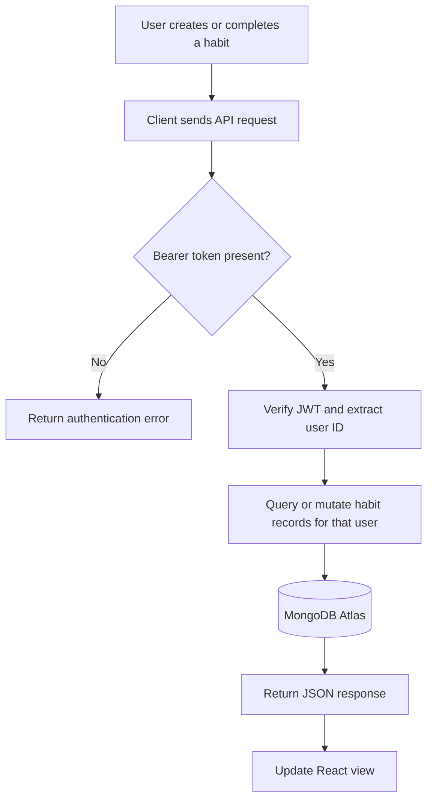
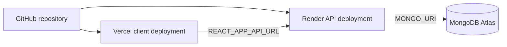

# Grind Set

> Daily momentum for meaningful habits.

Grind Set is a full-stack habit tracking application for creating routines, recording daily completions, maintaining streaks, and reviewing consistency over time. It provides account-based habit data, username personalization, a focused dashboard, analytics, theme switching, and daily motivation.

## Contents

- [Product Overview](#product-overview)
- [Current Features](#current-features)
- [Technology Stack](#technology-stack)
- [Architecture](#architecture)
- [Application Flow](#application-flow)
- [Repository Structure](#repository-structure)
- [Data Model](#data-model)
- [Prerequisites](#prerequisites)
- [Local Development](#local-development)
- [Environment Variables](#environment-variables)
- [Available Scripts](#available-scripts)
- [API Reference](#api-reference)
- [Deployment](#deployment)
- [Security Notes](#security-notes)
- [Validation and Troubleshooting](#validation-and-troubleshooting)
- [Roadmap](#roadmap)
- [Contributing](#contributing)
- [License](#license)
- [Author](#author)

## Product Overview

Grind Set helps users turn small repeated actions into durable routines. Each account has its own habits and completion history. Users can:

1. Create an account with a username, email-based user ID, and password.
2. Sign in and receive a JWT-backed session.
3. Create habits and mark them complete for the current day.
4. Review streaks, completions, and consistency analytics.
5. Update their username from Settings.
6. Switch between light and dark themes.
7. Receive a deterministic daily motivation quote from a 30-quote rotation.

Passwords are hashed on the server with bcrypt before being stored. Habit records are associated with the authenticated user's MongoDB ID.

## Current Features

### Authentication and Accounts

- Account registration with username, email user ID, and password.
- Login with email and password.
- bcrypt password hashing.
- JWT authentication for protected API requests.
- Protected client routes for Dashboard, Habits, Analytics, Profile, and Settings.
- Username editing from Settings.
- Local profile display synchronized across the Dashboard, Navbar, Profile, and Settings views.

### Habit Tracking

- Create a habit from the Dashboard or Habits page.
- Prevent duplicate habit names for the same user, case-insensitively.
- Mark a habit complete once per day.
- Store completion dates as historical records.
- Calculate current and longest streaks.
- Delete habits belonging to the authenticated user.

### Dashboard

- Daily completion count and progress bar.
- Habit list with completion controls and streak badges.
- Best current streak summary.
- Seven-day activity indicators.
- Daily motivation card using a 30-quote calendar rotation.

### Analytics and Preferences

- Total habits.
- Total completions.
- Average streak.
- Most consistent habit.
- Native responsive performance bar chart that works in light and dark themes.
- Light and dark theme toggle with persisted browser preference.
- Grind Set branding and supplied flame logo.

## Technology Stack

| Layer | Technology | Role |
| --- | --- | --- |
| Frontend | React 19, React Router, Tailwind CSS | Single-page application and layouts |
| Icons | Lucide React | Interface icons |
| Backend | Node.js, Express 5 | REST API and request handling |
| Database | MongoDB Atlas, Mongoose | Persistent user and habit data |
| Authentication | bcryptjs, JSON Web Tokens | Password hashing and authenticated sessions |
| Deployment | Vercel, Render, MongoDB Atlas | Frontend hosting, API hosting, and database |
| Tooling | npm, Git, GitHub, Create React App | Development and source control |

## Architecture

The repository contains two independently runnable applications:

- `client`: React frontend served locally on port 3000 by default and deployed to Vercel.
- `server`: Express API served locally on port 5000 by default and deployed to Render.
- MongoDB Atlas: shared persistent data store accessed only by the server.



The frontend never connects directly to MongoDB. It sends the JWT in the `Authorization` header when calling protected habit and profile endpoints.

## Application Flow

### Account and Session Flow



### Protected Habit Request Flow



### Request Lifecycle

```text
User interaction
      |
      v
React component
      |
      v
Client API service
      |
      |  HTTP request with optional Bearer token
      v
Express route
      |
      v
JWT verification for protected routes
      |
      v
Mongoose query
      |
      v
MongoDB Atlas
      |
      v
JSON response -> React state -> Updated interface
```

## Repository Structure

```text
Daily-Habit-Tracker/
|
|-- client/
|   |-- public/
|   |   |-- flame-logo.png
|   |   |-- index.html
|   |   |-- manifest.json
|   |   `-- robots.txt
|   |-- src/
|   |   |-- components/
|   |   |   |-- common/ProtectedRoute.jsx
|   |   |   `-- layout/
|   |   |       |-- Navbar.jsx
|   |   |       `-- Sidebar.jsx
|   |   |-- pages/
|   |   |   |-- Analytics.jsx
|   |   |   |-- Auth.jsx
|   |   |   |-- Dashboard.jsx
|   |   |   |-- Habits.jsx
|   |   |   |-- Profile.jsx
|   |   |   `-- Settings.jsx
|   |   |-- services/api.js
|   |   |-- styles/terminal-theme.css
|   |   |-- App.js
|   |   |-- index.css
|   |   `-- index.js
|   |-- package.json
|   |-- tailwind.config.js
|   |-- postcss.config.js
|   |-- vercel.json
|   `-- build/
|
|-- server/
|   |-- models/
|   |   |-- Habit.js
|   |   `-- User.js
|   |-- routes/
|   |   |-- auth.js
|   |   `-- habits.js
|   |-- server.js
|   |-- package.json
|   `-- vercel.json
|
|-- .gitignore
`-- README.md
```

## Data Model

### User

Stored in the MongoDB `users` collection:

| Field | Type | Description |
| --- | --- | --- |
| `_id` | ObjectId | MongoDB-generated user ID used inside JWTs |
| `username` | String | User's display name, 2 to 30 characters |
| `email` | String | Email-based login ID |
| `password` | String | bcrypt password hash; plain passwords are not stored |

### Habit

Stored in the MongoDB `habits` collection:

| Field | Type | Description |
| --- | --- | --- |
| `_id` | ObjectId | MongoDB-generated habit ID |
| `userId` | String | Authenticated owner's MongoDB ID |
| `title` | String | Habit name |
| `completedDates` | String array | Dates on which the habit was completed |

## Prerequisites

Install the following before starting:

- Node.js 18 or newer recommended.
- npm.
- Git.
- A MongoDB Atlas account and database user.
- A GitHub account for remote collaboration and deployment.

## Local Development

### 1. Clone the repository

```bash
git clone https://github.com/Krissh360/Daily-Habit-Tracker.git
cd Daily-Habit-Tracker
```

### 2. Install backend dependencies

```bash
cd server
npm install
```

### 3. Install frontend dependencies

```bash
cd ../client
npm install
```

### 4. Configure the server environment

Create `server/.env` locally. Never commit this file:

```env
MONGO_URI=mongodb+srv://<database-user>:<database-password>@<cluster>/<database>?retryWrites=true&w=majority
JWT_SECRET=<long-random-secret>
PORT=5000
NODE_ENV=development
```

The current server reads `MONGO_URI` and `JWT_SECRET`. `PORT` is optional and defaults to `5000`.

### 5. Start the API

From `server/`:

```bash
npm start
```

The API should be available at `http://localhost:5000`.

### 6. Start the React client

From `client/` in a second terminal:

```bash
npm start
```

The client should be available at `http://localhost:3000`. The development proxy forwards `/api` requests to `http://localhost:5000`.

If port 3000 is already in use, stop the existing React process or accept the alternative port offered by Create React App.

## Environment Variables

### Server variables

| Variable | Required | Purpose |
| --- | --- | --- |
| `MONGO_URI` | Yes | MongoDB Atlas connection string |
| `JWT_SECRET` | Yes | Secret used to sign and verify JWTs |
| `PORT` | No | Local server port; defaults to `5000` |
| `NODE_ENV` | No | Runtime environment, such as `development` or `production` |
| `CLIENT_URL` | Optional | Frontend origin if CORS is restricted during deployment |

### Client variables

| Variable | Required | Purpose |
| --- | --- | --- |
| `REACT_APP_API_URL` | Production | Public backend URL, without the trailing `/api` |

Example production client variable:

```env
REACT_APP_API_URL=https://your-api-service.onrender.com
```

The client app appends `/api` automatically.

## Available Scripts

### Client

Run from `client/`:

| Command | Purpose |
| --- | --- |
| `npm start` | Start the React development server |
| `npm run build` | Create the production build in `client/build` |
| `npm test` | Run the Create React App test runner |

### Server

Run from `server/`:

| Command | Purpose |
| --- | --- |
| `npm start` | Start the Express server |

## API Reference

The API is mounted under `/api`. Protected endpoints require:

```http
Authorization: Bearer <jwt-token>
```

### Authentication and Profile

| Method | Endpoint | Authentication | Description |
| --- | --- | --- |
| `POST` | `/api/auth/register` | No | Create a user account |
| `POST` | `/api/auth/login` | No | Verify credentials and issue a JWT |
| `PATCH` | `/api/auth/profile` | Yes | Update the authenticated user's username |

Register request:

```json
{
  "username": "krissh",
  "email": "krissh@example.com",
  "password": "use-a-strong-password"
}
```

Login request:

```json
{
  "email": "krissh@example.com",
  "password": "use-a-strong-password"
}
```

Profile update request:

```json
{
  "username": "new-display-name"
}
```

### Habits and Analytics

| Method | Endpoint | Authentication | Description |
| --- | --- | --- | --- |
| `GET` | `/api/habits` | Yes | Return the authenticated user's habits and calculated streak data |
| `POST` | `/api/habits` | Yes | Create a habit |
| `PUT` | `/api/habits/complete/:id` | Yes | Mark a habit complete for today |
| `DELETE` | `/api/habits/:id` | Yes | Delete one of the authenticated user's habits |
| `GET` | `/api/habits/analytics` | Yes | Return totals, completions, average streak, and top habit |

Create habit request:

```json
{
  "title": "Read for 20 minutes"
}
```

Analytics response shape:

```json
{
  "totalHabits": 3,
  "totalCompletions": 12,
  "averageStreak": "4.00",
  "mostConsistentHabit": "Read for 20 minutes"
}
```

## Deployment

The recommended production layout is:



### Deploy the API to Render

1. Create a Render Web Service from the GitHub repository.
2. Set the root directory to `server`.
3. Set the build command to `npm install`.
4. Set the start command to `npm start`.
5. Add these Render environment variables:

```env
MONGO_URI=<production-mongodb-connection-string>
JWT_SECRET=<new-long-random-production-secret>
NODE_ENV=production
```

6. Deploy and verify the service root returns `API is running`.
7. Copy the Render service URL for the Vercel configuration.

### Deploy the client to Vercel

1. Import the same GitHub repository into Vercel.
2. Set the root directory to `client`.
3. Select Create React App, or use these settings:
   - Build command: `npm run build`
   - Output directory: `build`
4. Add this Vercel environment variable:

```env
REACT_APP_API_URL=https://your-api-service.onrender.com
```

5. Deploy the client.
6. Test registration, login, habit creation, completion, username editing, analytics, refresh, and theme switching from the deployed URL.

The client uses `client/vercel.json` to support React Router fallback routes.

## Security Notes

- Never commit `.env` files or paste secrets into source code, issues, or documentation.
- Use a unique production `JWT_SECRET`; do not use example values.
- Rotate database credentials if a connection string has ever been exposed.
- Use HTTPS for all deployed client-to-API traffic.
- Configure MongoDB Atlas network access deliberately for the deployment environment.
- Keep passwords server-side and hashed with bcrypt.
- Treat browser `localStorage` as client-accessible data; never store a plaintext password there.
- Restrict production CORS to the deployed Vercel origin when the deployment environment is stable.

## Validation and Troubleshooting

### Build validation

```bash
cd client
npm run build
```

### API health check

Open the deployed API root or run:

```bash
curl http://localhost:5000/
```

Expected response:

```text
API is running
```

### Common issues

| Symptom | Likely cause | Check |
| --- | --- | --- |
| Client cannot reach API | Missing or incorrect `REACT_APP_API_URL` | Confirm the Vercel variable and redeploy |
| MongoDB connection fails | Invalid URI or Atlas network rule | Check `MONGO_URI` and Atlas access settings |
| Login fails after secret rotation | Old JWT session | Log in again and clear stale browser storage if needed |
| React route returns 404 after refresh | Missing Vercel fallback | Confirm `client/vercel.json` is deployed |
| Port 3000 is busy | Existing React process | Stop the existing process or use the alternate port |

## Roadmap

Potential future improvements include:

- Habit editing and richer habit metadata.
- Password reset and account recovery.
- Expiring JWTs with refresh-token support.
- Browser reminders and notification preferences.
- Expanded weekly and monthly trend analytics.
- Automated API and component test coverage.
- Improved server-side validation and structured error handling.
- Custom domains and stricter production network controls.

## Contributing

1. Create a branch from `main`:

   ```bash
   git checkout -b feature/short-description
   ```

2. Make a focused change that preserves existing behavior.
3. Run the relevant validation commands, especially `npm run build` for frontend changes.
4. Use a descriptive commit message, for example:

   ```bash
   git commit -m "Add weekly habit completion summary"
   ```

5. Push the branch and open a pull request against `main`.
6. Include a concise summary, validation details, and any deployment considerations.

## License

This project is intended for educational and demonstration purposes. All rights are reserved by the author unless otherwise stated.

## Author

**Krissh Chhabra**

- GitHub: [Krissh360](https://github.com/Krissh360)

Built with focus, consistency, and a genuine interest in full-stack development.
